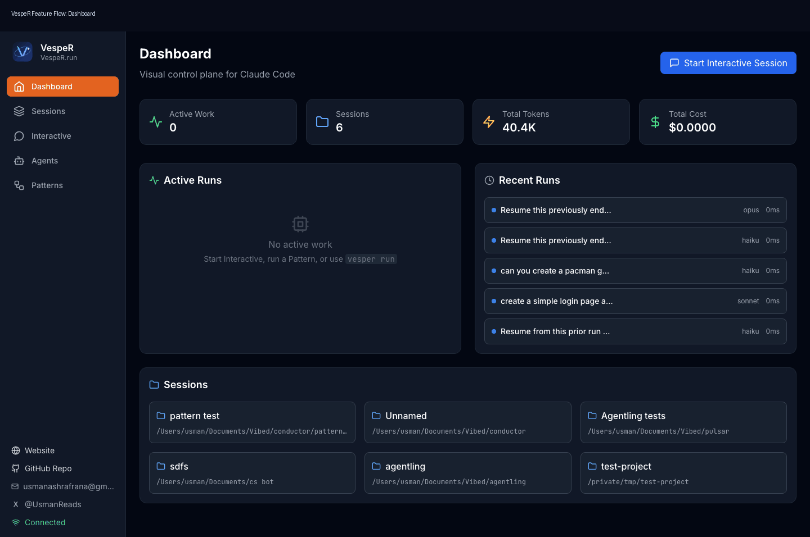
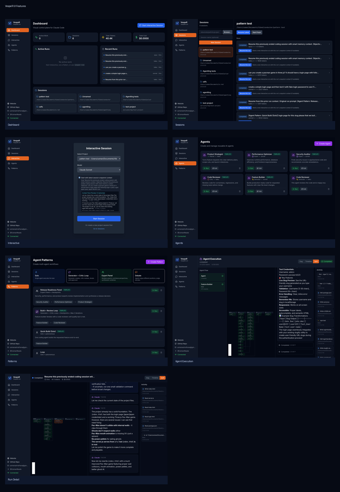
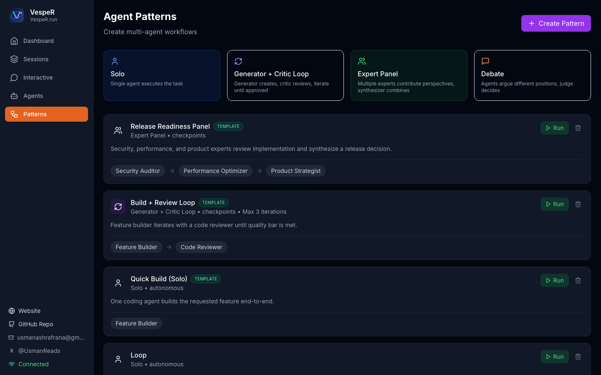
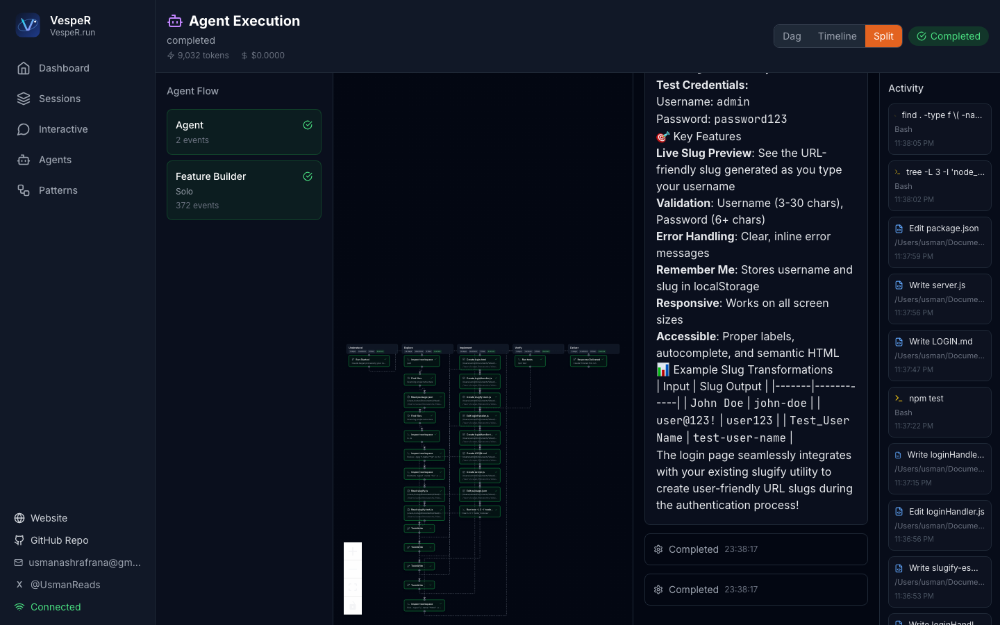

# VespeR

Visual control plane for Claude Code workflows.

[Website](https://vesper.run) • [Repository](https://github.com/ranausmanai/VespeR)

VespeR helps you run coding workflows with more control than a single chat stream:
- reusable specialist agents
- reusable multi-agent patterns
- execution observability (DAG + timeline + activity)
- resumable interactive sessions with smart memory context

CLI commands:
- `vesper` (preferred)
- `agentling` (backward-compatible alias)

## Product Tour





## What VespeR Does

1. Interactive sessions you can rejoin
- Start multiple interactive sessions and switch between them.
- Stop current response without ending the session.

2. Agent Dock in chat
- Ask a specialist agent (reviewer, security, strategist, etc.).
- Inject agent output back into the active interactive session.

3. Pattern execution
- Run saved patterns such as:
  - `Quick Build (Solo)`
  - `Build + Review Loop`
  - `Release Readiness Panel`
  - `Expert Panel`
  - `Debate`

4. Execution visibility
- See what happened via DAG, timeline, and split activity views.
- Inspect tool usage and file-touch activity during agent/pattern runs.

5. Smart resume memory
- Ended runs are converted into structured memory.
- New interactive runs can start with ranked context packs (goal, touched files, open loops, validations, next action).

## Key Use Cases

1. Build and review in one pass
- Run `Build + Review Loop` so code generation and code review are linked.

2. Release go/no-go checks
- Run `Release Readiness Panel` for security/performance/product sign-off.

3. Long-running continuity
- End and later resume with context pack instead of replaying long transcripts.

4. Debugging agent behavior
- Use DAG/timeline/activity to diagnose loops, failures, and churn.

## Requirements

- Python `3.10+`
- Node.js `18+`
- Claude Code CLI available on `PATH`

## Install

```bash
# Clone
git clone https://github.com/ranausmanai/VespeR.git
cd VespeR

# Backend
pip install -e .

# Frontend
npm -C frontend install
npm -C frontend run build
```

## Run

```bash
# Start UI + API server
vesper ui --port 8420 --no-browser
```

Open: `http://127.0.0.1:8420`

If `vesper` is not found, use:
```bash
agentling ui --port 8420 --no-browser
```

## CLI Commands

```bash
# Start UI
vesper ui

# One-shot tracked run
vesper run "add JWT auth with tests"

# Replay run timeline in terminal
vesper replay <run-id>
```

## Quick Workflow (UI)

1. Create a project session in `Sessions`.
2. Start an interactive session in `Interactive`.
3. Use Agent Dock for ask/inject specialist agents.
4. Run a pattern in `Patterns` and inspect it in `Agent Execution`.
5. End and resume with context pack in `Sessions > Resume this run`.

## Example Prompts

Build + Review Loop:
```text
Add src/utils/slugify.js with slugify(text) and tests in tests/slugify.test.js. Run npm test.
```

Release Readiness Panel:
```text
Assess this repo for v0.1 alpha release readiness. Return go/no-go, top 5 risks, and this-week fixes.
```

## Screenshots

Dashboard:


Interactive:


Patterns:


Agent Execution:


## Project Notes

- VespeR started as Agentling and was rebranded.
- Internal package/module names may still reference `agentling` for compatibility.

## Development

```bash
# Run frontend in dev mode (optional)
npm -C frontend run dev
```

## License

MIT
